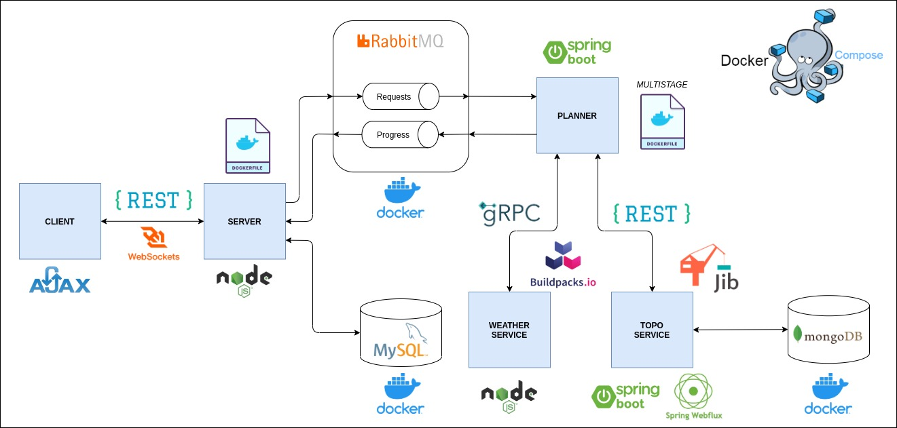
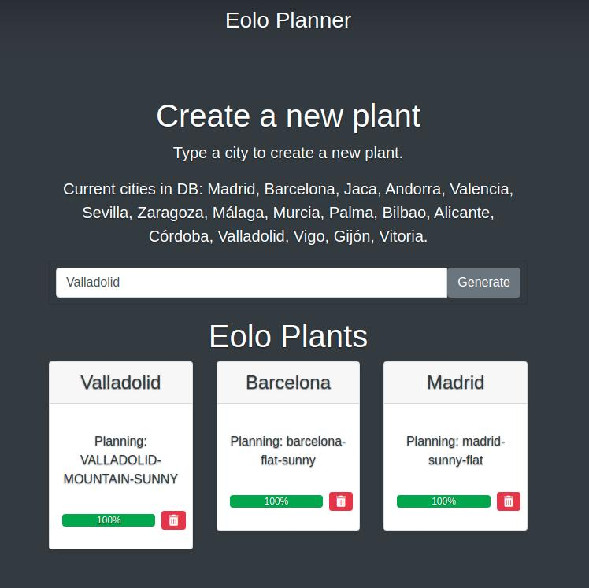

# Dockerizing EoloPlanner

This project is a distributed application composed by several services that communicate with each other using REST API, gRPC and RabbitMQ. The application exposes a web interface that communicates with the server with REST API and WebSockets. 

Some services are implemented with Node.js/Express and others with Java/Spring.

All mentioned services are going to be dockerized, so in order to run this project is needed to have [docker](https://docs.docker.com/engine/install/ubuntu/) and [docker compose](https://docs.docker.com/compose/install/) installed on your computer.

## Architecture



## Building and publishing docker images in dockerhub

Is possible to change the account where docker images will be pushed in dockerhub, current value is my account, but if you want to upload them to yours, just change the value for ```DOCKERHUB_NAME``` var inside the ```build-publish-docker-images.sh``` script.

If you wish to run the script, you need to have [Pack](https://buildpacks.io/docs/tools/pack/) installed on your computer.

To build server, planner, toposervice and weatherservice docker images and push them to dockerhub, just execute:

```sh
$ ./build-publish-docker-images.sh
```

As it can be seen in the script, ```latest``` and ```1.0``` versions of each service are built and uploaded.

## Changes applied

PENDING

## Launch the application (production)

Also is provided ```docker-compose-prod.yml``` file in order to launch whole application. This file orchestrates the startup of the containers and it can be executed:

```sh
$ docker-compose -f docker-compose-prod.yml up
```

Environment variables values are provided in ```prod.env``` file

When the application will be ready, web interface can be reached in: [http://localhost:3000/](http://localhost:3000/)



Progress of the applied operations in the web application can be monitored in containers logs.

## Author

[David Rojo (@david-rojo)](https://github.com/david-rojo)
